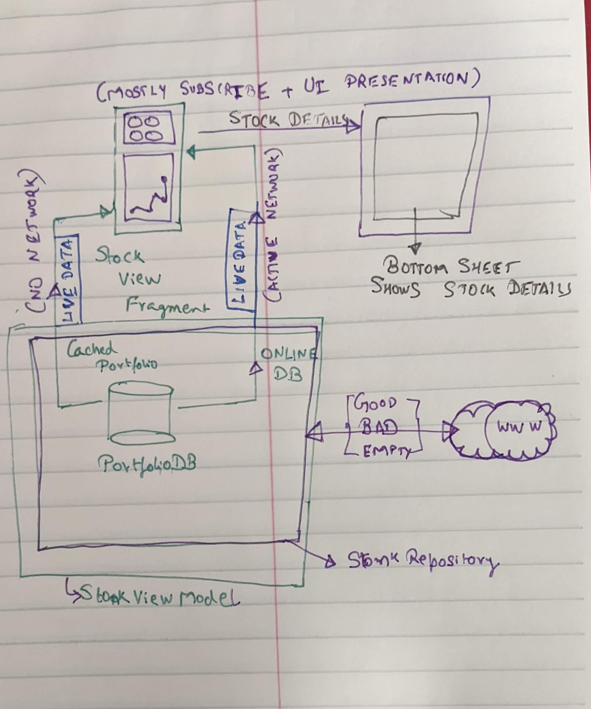

Project Status

-----

HOW TO BUILD APK for Stonks App

1. Use Android Studio:
   I used Android Studio Config: 

    Android Studio Dolphin | 2021.3.1 Canary 7
    Build #AI-213.6777.52.2113.8305692, built on March 15, 2022
    Runtime version: 11.0.13+0-b1751.21-8125866 aarch64
    VM: OpenJDK 64-Bit Server VM by JetBrains s.r.o.
    macOS 12.3
    GC: G1 Young Generation, G1 Old Generation
    Memory: 4096M
    Cores: 10
    Registry:
    ide.intellij.laf.enable.animation=true
    external.system.auto.import.disabled=true
    ide.text.editor.with.preview.show.floating.toolbar=false
    ide.balloon.shadow.size=0
    
    Non-Bundled Plugins:
    wu.seal.tool.jsontokotlin (3.7.2)
    net.vektah.codeglance (1.5.4)
    idea.plugin.protoeditor (213.6461.28)
    dev.polek.adbwifi (1.2.4)
    com.mallowigi.idea (16.0)
    String Manipulation (9.4.0)
    Dilbert (1.9.0.168)
    zielu.gittoolbox (212.8.8)
    com.developerphil.adbidea (1.6.4)
    com.suusan2go.kotlin-fill-class (1.0.11)

2. Use Gradle: 
  a. Download and extract the project folder.
  b. Run `./gradlew :app:assemble` --> This will compile the app into $rootFolder/app/build/outputs/apk
  c. Run `./gradlew :app:installDebug` --> This will compile + install the app directly onto the Android device.
  d. Attached apk to the project to move quickly.
  e. Run `./gradlew check` --> Unit tests + Lint   
   
3. FAQ's

* I am seeing an error: 
  What went wrong:
  Could not determine the dependencies of task ':app:assemble'.
> Could not create task ':app:assembleRelease'.
> Could not create task ':app:lintVitalRelease'.
> SDK location not found. 
> Define location with an ANDROID_SDK_ROOT environment variable or by setting the sdk.dir path in your project's 
> local properties file at '/Users/<user-name>/Desktop/archive/local.properties'.

-- Please define location for android studio sdk as per instructions. 

------------------------------------------------------------------------------------------------------------------------------------------------------------------------

# Cash App Stocks Take Home Project
Build a stocks app that shows a list of stock symbols and prices for a set of stocks parsed from the provided JSON endpoints.
Requirements
Your app should...
Handle loading, error, and empty states
Display the returned information in a list (feel free to add whatever UI touches you'd like)
Have unit tests that protect against regressions (don't worry about snapshot or UI tests)
This project should take you around 23 hours, at the end of this time, please take about 15 minutes to write up your experience in a README file to give us a window into your thought process. This README should tell us...
Cash App Stocks Take Home Project 1
📊

 The architectural approach you took and why
The trade offs you made and why
How to run your project
3rd party libraries or copied code you may have used Any other information that you would like us to know
 This project will be used throughout your Cash interview experience, so please ensure that you feel comfortable modifying, maintaining, and extending this code.
Details
Portfolio Endpoints
We have provided an endpoint which will return your current portfolio. When called this will return a JSON object containing a list of stocks with some relevant information.
 https://storage.googleapis.com/cash-homework/cash-stocks- api/portfolio.json
  You can also simulate a malformed response using the following provided endpoint (it’s okay to discard the entire response if it is malformed):
 https://storage.googleapis.com/cash-homework/cash-stocks- api/portfolio_ malformed.json
  Cash App Stocks Take Home Project 2
🔗
🔗
💡

Finally, you can simulate an empty response using the final endpoint.
 https://storage.googleapis.com/cash-homework/cash-stocks- api/portfolio_empty.json
  Response Structure
    Field Data type Nullable? Description
     stocks Array false The list of stocks that are currently in your portfolio.
   Stock Structure
    Field
Data type
Nullable?
Cash App Stocks Take Home Project 3
Notes
 ticker String false This is the ticker symbol for a given stock.
  name String false
The name of the company the ticker belongs to.
   currency String false The denominating currency for this stock.
    current_price_cents Integer false
The currently trading price for this specific stock in USD cents.
   quantity Integer true
The amount of this stock that is currently in the portfolio.
    current_price_timestamp Integer false
A Unix timestamp represented in UTC from when the current price was last calculated.
   Example JSON
 {
"stocks": [
{
"ticker": "UA",
"name": "Under Armour, Inc.", "currency": "USD", "current_price_cents": 844, "quantity": null,
 🔗

Cash App Stocks Take Home Project 4
 "current_price_timestamp": 1597942385 },
...
] }

Other Stuff
1. Use What You Know
2. We’re looking to see you at your best – as such, please use the language and frameworks you’re most comfortable with on your chosen mobile platform. 
3. This means that if you’re most proficient with Objective-C or Java, use that – don’t feel pressured to use Swift or Kotlin! 
4. Cash App ships all four in production, so we’re not going to prefer answers in one language over another.
5. Show Us Your Strengths 
6. We want to see what you’re best at. 
7. Feel free to use 3rd party libraries, but please understand that we want this exercise to be a good representation of your coding ability.

UseCases Covered by Mohit: 
1. Load and display Portfolio data (Good/Bad/Malformed URL).
2. Allow user to switch between different Portfolio endpoints. 
3. Support a rudimentary form of offline mode. 
4. Show Portfolio details. 
5. Some form of sorting portfolio into a grid recyclerview. 

3P Libraries used: 
1. DI: Hilt
2. Network Infrastructure: EitherNet + Retrofit + Moshi (Tried malformed parsing but I was unsuccessful to setup correctly 😭)
3. Portfolio Chart UI: com.github.PhilJay:MPAndroidChart
4. List UI: RecyclerView
5. Unit Testing: Junit + Mockito 
6. Concurrency: Rudimentary Coroutines.

Demo Video: https://github.com/mohitb117/Stonks/blob/main/artifacts_from_mohit/End-To-End-Stongs.mp4

| Design/Rough Sketch | Demo |
| ---- |---- |
|  |  |

